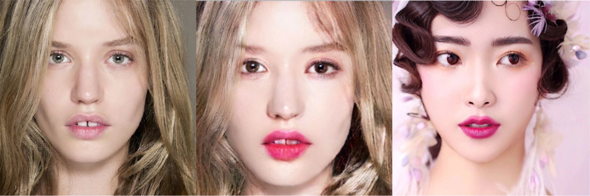
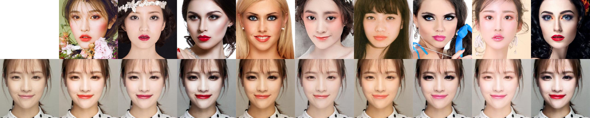

# DL-project-Makeup-Transfer
### Model for Project - PSGAN
We use Makeup Transfer for training which is saved in  
Download it, unzip it and put it in PSGAN folder and name the subfolder `data` 
You can also use Makeup-Wild data to test which is saved in   

In the PSGAN folder, train the model using  
```bash
python3 train.py 
```
Results will be saved in `log/` folder.  

Test the model with:  
```bash
python3 test.py 
```
Our example:  



### Baseline Model - BeautyGAN
There is a BeautyGAN pretrain model, model is saved in https://drive.google.com/file/d/1Y-XDe8DLGFiChCGkJ1s8jxQ8aQrE5SpK/view?usp=sharing  
Unzip it and put it in BeautyGAN folder. Run the code with 
```bash
python main.py --nomake_up 1.jpg
```
Our example:  

