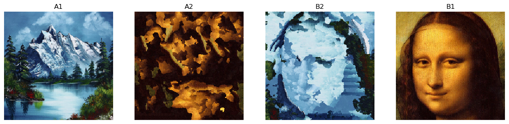
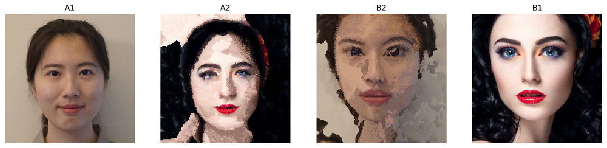

# DL-project-Makeup-Transfer
## Authors: Jingyan Dai(jingyand) Anyu Chen(anyuc)

We choose baseline in two aspects. First is image-to-image method which contains Deep Image Analogy and CycleGAN. Second is the makeup transfer method called BeautyGAN.

**Deep Image Analogy**   
In DeepImageAnalogy folder, run the code using `python DeepImageAnalogy.py`. Results will be saved in the `Results/` folder.  
Our examples:

**CycleGAN**   
In CycleGAN folder, run the code `python train.py --dataroot ./datasets/summer2winter_yosemite --name summer2winter_yosemite_cyclegan --model cycle_gan` to train.  
run the code `python test.py --dataroot ./datasets/summer2winter_yosemite --name summer2winter_yosemite_cyclegan --model cycle_gan`.  
Results will be saved in the `results/` folder. We also use style_monet, style_cezanne, style_ukiyoe, style_vangogh to train.
Our examples:

